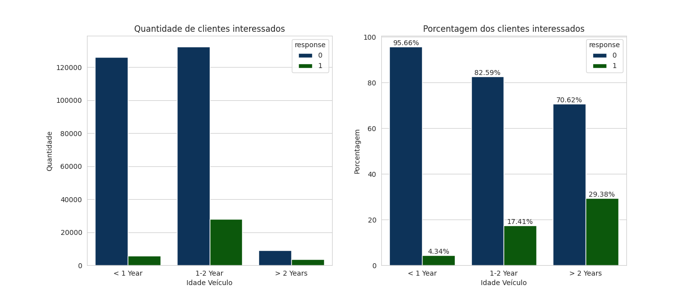
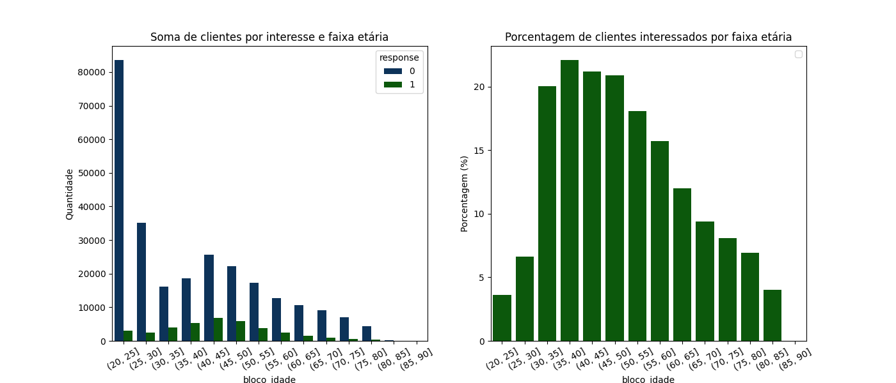
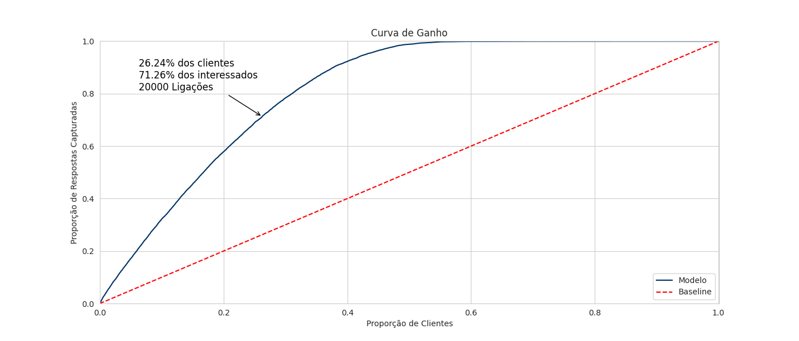
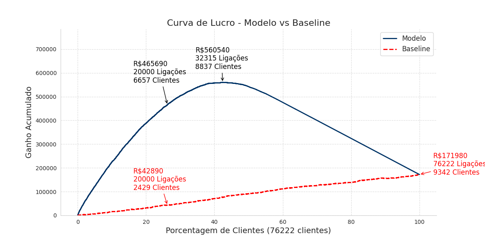

# Projeto de Propensão de Compra de Seguro de Automóvel  

<!--  -->

# Problema de Negócio  
Uma empresa de seguros de saúde deseja identificar quais clientes podem estar interessados em um novo produto: um seguro de automóvel. Como a equipe de vendas possui um limite de 20.000 ligações, é essencial priorizar os clientes mais propensos a comprar para otimizar os recursos e maximizar as conversões.

# Objetivo  
Desenvolver um modelo de Machine Learning capaz de prever a propensão de compra do seguro de automóvel, ranqueando os clientes para otimizar o contato da equipe de vendas.

# Produto Final  
O resultado é um modelo alocado numa API em nuvem, que gera uma probabilidade de compra para cada cliente, disponibilizando os resultados diretamente via Google Sheets. Os valores podem ser utilizados pelo time de vendas para aumentar a eficiência nas abordagens, fazendo as ligações para aqueles clientes com a maior probabilidade de compra.

## [Link para o Notebook do Projeto](https://github.com/RafaelLuckner/Propensao_Compra/blob/main/notebooks/propensao_projeto.ipynb)
  

# Planejamento da Solução

## 1. Compreensão do Negócio  
- **Definição do problema de negócio:** A empresa de seguros de saúde deseja identificar os clientes mais propensos a comprar um novo produto (seguro de automóvel), otimizando o uso das 20.000 ligações disponíveis para maximizar as conversões.
- **Planejamento da abordagem e do resultado esperado:** Desenvolver um modelo preditivo para ranquear os clientes, priorizando aqueles com maior probabilidade de compra e garantindo o uso mais eficiente das ligações.

## 2. Compreensão dos Dados  
- **Análise exploratória para identificar padrões e inconsistências:** Avaliação das distribuições, presença de outliers e correlações entre as variáveis, com visualizações para entender os dados.
- **Geração de insights úteis durante o desenvolvimento do projeto:** Identificação de variáveis importantes, possíveis dados faltantes e padrões que influenciam o interesse no seguro de automóvel.

## 3. Preparação dos Dados  
- **Criação de novas features e encoding de variáveis categóricas:** Engenharia de features para melhorar a capacidade preditiva do modelo e codificação de variáveis categóricas.
- **Normalização dos dados e seleção de features por importância:** Normalização para ajustar variáveis de diferentes escalas e uso de técnicas de seleção para identificar as features mais relevantes para a previsão.

## 4. Modelagem  
- **Teste de diversos algoritmos:** Avaliação de diferentes algoritmos, com a Random Forest mostrando o melhor desempenho.
- **Ajuste de hiperparâmetros com cross-validation:** Realização de validação cruzada e ajuste de hiperparâmetros para melhorar a generalização e evitar overfitting.
- **Aplicação nos dados de teste para garantir generalização:** Teste no conjunto de dados reservado para garantir que o modelo tenha boa performance e não esteja sobreajustado aos dados de treino.

## 5. Avaliação  
- **Métricas utilizadas:**  
  - **Precision top k:** Avalia a precisão nos k clientes mais propensos a compra, priorizando as ligações.
  - **Recall top k:** Mede a capacidade do modelo em recuperar os clientes mais relevantes nos top k, importante para não perder oportunidades.
  - **Curva de Ganho:** Análise de como o modelo contribui para maximizar as conversões, comparando diferentes estratégias de priorização.

## 6. Implantação do Modelo em um Ambiente de Produção  
- **Disponibilização do modelo em uma API:** O modelo foi alocado em  uma API que receberá novos dados e retornará previsões de probabilidade de compra.
- **Implementação via Google Sheets para facilitar o uso da equipe de vendas:** Os resultados serão exportados para Google Sheets, facilitando o acesso da equipe de vendas às previsões, permitindo uma tomada de decisão mais eficiente.

  

# Principais Insights  

### 1. A maior parte dos clientes interessados tem veículos com mais de 1 ano. E os com mais de 2 anos tem uma porcentagem de interesse maior.

- Nota: response = 1 indica interessados, e response = 0 indica não interessados.

### 2. Clientes entre 30 e 55 anos têm maior propensão a contratar seguros para veículos.

### 3. Clientes em regiões onde a porcentagem de veículos que já foram danificados é relevante tem uma maior propensão a desejar um seguro.

  

# Tradução para Resultados no Negócio
## Curva de Ganho  
O modelo permite que, ao contactar apenas os **26% dos clientes mais propensos**, a equipe de vendas capture **71% de todas as conversões possíveis**. Isso reduz drasticamente o esforço necessário para atingir bons resultados.  

Para entender melhor o impacto do modelo, seu desempenho foi comparado a um **modelo baseline**, que representa uma abordagem **sem inteligência de priorização**. Nesse caso, as ligações são feitas de forma aleatória para qualquer cliente da base, sem considerar a probabilidade de conversão.  

O gráfico abaixo ilustra como a estratégia baseada em Machine Learning melhora significativamente a taxa de conversão em comparação com esse baseline.

As anotações no gráfico representam:   
1. A **porcentagem de clientes contatados**.  
2. A **porcentagem de clientes interessados** em relação ao total de interessados na base.  
3. O **número de ligações realizadas** para atingir tal resultado.

---

## Curva de Lucro  
Para avaliar o impacto do modelo nos resultados de negócio, desenvolvi a curva de lucro. Ela foi calculada considerando um custo de ligação de **R$10,00** e um retorno por cliente captado de **R$100,00**.  

As anotações no gráfico representam:  
1. O **lucro total**, contabilizando o custo das ligações e o número de clientes captados.  
2. O **número de ligações realizadas** para atingir tal resultado.  
3. O numero de **clientes captados**.  

Com o modelo otimizado, ao ligar para **20.000 clientes**, o lucro seria de **R$465.690**. Uma abordagem sem priorização resultaria em um lucro muito inferior, de apenas R$42.890, ou seja, R$422.800 a menos do que a abordagem otimizada com Machine Learning. 

Podemos também identificar o **ponto máximo da curva de lucro**, que ocorre ao ligar para **32.315 clientes**, atingindo **R$560.540**. Esse ponto representa a melhor relação entre custo e retorno antes que os ganhos marginais comecem a diminuir.  

Vale ressaltar que esses cálculos foram feitos assumindo um **custo fixo e um ganho único por cliente captado**. Na prática, essa análise pode ser refinada considerando fatores como:  
- O **valor do cliente ao longo do tempo (Lifetime Value - LTV)**.  
- O **impacto de múltiplas tentativas de contato** para um mesmo cliente.  
- Diferentes **estratégias de segmentação e priorização** para otimizar a abordagem.  

Essa visualização nos dá uma ótima ideia de como alocar os recursos de vendas de forma mais eficiente, permitindo uma tomada de decisão embasada em dados.  

 
  

# Machine Learning  

## Modelos Utilizados e Resultados  

Para avaliar o desempenho dos modelos, utilizei as métricas **Precision Top K** e **Recall Top K**, que são essenciais em um cenário onde o objetivo é priorizar os clientes mais propensos à conversão.  

- **Precision Top K**: Mede a porcentagem de clientes que realmente converteram entre os **K** clientes mais bem classificados pelo modelo.  
- **Recall Top K**: Mede a proporção de todas as conversões reais da base que estão dentro dos **K** clientes priorizados pelo modelo.  

**No conjunto de teste, utilizamos K = 20.000**, ou seja, estamos analisando o desempenho do modelo ao selecionar os **20.000 clientes mais bem ranqueados**.  

A tabela abaixo apresenta os resultados dos modelos testados em dados de validação:  

| Modelo                | Precision Top K | Recall Top K |
|---------------------- |--------------- |-------------|
| **Random Forest**     | **33.49%**      | **71.26%**  | 
| Regressão Logística   | 32.39%          | 62.91%      |
| Decision Tree Simples | 22.46%          | 47.79%      |

---

## Escolha do Modelo Final  
O **Random Forest** foi escolhido como modelo final por apresentar **os melhores resultados** tanto em **precisão** quanto em **recall**, permitindo à equipe de vendas atingir um grande número de clientes potenciais com menos esforço. Além disso, o modelo oferece vantagens como:  
- Capacidade de capturar padrões complexos e interações entre variáveis de forma eficiente..  
- Maior robustez contra overfitting, especialmente em comparação com árvores de decisão simples.  
- Facilidade de interpretação, permitindo analisar a importância das variáveis na predição.  

---

## Validação Cruzada e Teste do Modelo  
Para garantir que o modelo não estivesse superajustado aos dados de treino, utilizei **validação cruzada (Cross-Validation)** com **5 folds**, ajustando hiperparâmetros via **RandomizedSearchCV**.  

Após selecionar os melhores hiperparâmetros, o modelo foi treinado nos dados de treino e avaliado em um conjunto de **teste real (K = 20.000 clientes mais bem ranqueados)**, obtendo os seguintes resultados:  

| Conjunto de Dados  | Precision Top K | Recall Top K |
|-------------------|---------------|-------------|
| **Validação (Cross-Val Média)** | 33.50% | 71.27% |
| **Teste Final (K = 20.000)**     | 33.28% | 71.26% |

Os resultados mostraram **consistência entre o Cross-Validation e o teste final**, indicando que o modelo generaliza bem para novos dados.  

Com esse modelo, a equipe de vendas pode otimizar seus esforços, focando nos clientes com maior probabilidade de conversão e maximizando o retorno das ligações.  

  

# Conclusão e Próximos Passos  

## Conclusão  
A aplicação de Machine Learning para ranquear os clientes mais propensos à conversão demonstrou um impacto significativo na eficiência da equipe de vendas.  

O **Random Forest** se destacou como o melhor modelo, alcançando **71,26% do total de conversões potenciais ao contactar apenas 26% da base de clientes**, o que representa um grande avanço em relação a uma abordagem aleatória. Além disso, a análise da **curva de lucro** mostrou que o uso do modelo pode aumentar consideravelmente os resultados financeiros da empresa, permitindo uma alocação mais eficiente dos recursos.  

A validação cruzada confirmou que o modelo **generaliza bem** para novos dados, e os testes finais mostraram **consistência nos resultados**, garantindo que a estratégia possa ser aplicada com confiança.  

---

## Próximos Passos  
Com um modelo robusto em mãos, os próximos passos para maximizar os resultados incluem:  

1. **Otimização do modelo**  
   - Explorar **técnicas de feature engineering** para melhorar ainda mais a performance do modelo.  
   - Testar **modelos adicionais**, como XGBoost e redes neurais, para avaliar possíveis ganhos de precisão e recall.  

2. **Acompanhamento e reavaliação periódica**  
   - Monitorar métricas de conversão reais e ajustar o modelo conforme necessário.  
   - Realizar re-treinamento periódico do modelo para garantir que ele continue refletindo padrões de comportamento dos clientes.  

3. **Expansão da abordagem**  
   - Explorar a aplicação do modelo para **outros produtos e serviços da empresa**, ajustando as variáveis conforme necessário.  
   - Implementar testes A/B para avaliar a **efetividade do modelo no ambiente real** e otimizar estratégias de contato.  

---

