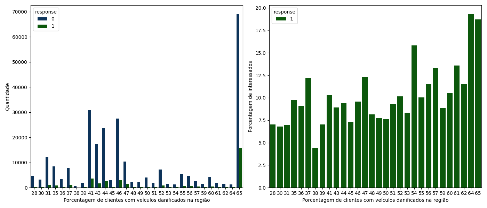

# Projeto de Propensão de Compra de Seguro de Automóvel  

<!--  -->

# Problema de Negócio  
Uma empresa de seguros de saúde deseja identificar quais clientes podem estar interessados em um novo produto: um seguro de automóvel. Como a equipe de vendas possui um limite de 20.000 ligações, é essencial priorizar os clientes mais propensos a comprar para otimizar os recursos e maximizar as conversões.

# Objetivo  
Desenvolver um modelo de Machine Learning capaz de prever a propensão de compra do seguro de automóvel, ranqueando os clientes para otimizar o contato da equipe de vendas.

# Produto Final  
O resultado é um modelo alocado numa API em nuvem, que gera uma probabilidade de compra para cada cliente, disponibilizando os resultados diretamente via Google Sheets. Os valores podem ser utilizados pelo time de vendas para aumentar a eficiência nas abordagens, fazendo as ligações para aqueles clientes com a maior probabilidade de compra.

 
  

# Planejamento da Solução

## 1. Compreensão do Negócio  
- **Definição do problema de negócio:** A empresa de seguros de saúde deseja identificar os clientes mais propensos a comprar um novo produto (seguro de automóvel), otimizando o uso das 20.000 ligações disponíveis para maximizar as conversões.
- **Planejamento da abordagem e do resultado esperado:** Desenvolver um modelo preditivo para ranquear os clientes, priorizando aqueles com maior probabilidade de compra e garantindo o uso mais eficiente das ligações.

## 2. Compreensão dos Dados  
- **Análise exploratória para identificar padrões e inconsistências:** Avaliação das distribuições, presença de outliers e correlações entre as variáveis, com visualizações para entender os dados.
- **Geração de insights úteis durante o desenvolvimento do projeto:** Identificação de variáveis importantes, possíveis dados faltantes e padrões que influenciam o interesse no seguro de automóvel.

## 3. Preparação dos Dados  
- **Criação de novas features e encoding de variáveis categóricas:** Engenharia de features para melhorar a capacidade preditiva do modelo e codificação de variáveis categóricas.
- **Normalização dos dados e seleção de features por importância:** Normalização para ajustar variáveis de diferentes escalas e uso de técnicas de seleção para identificar as features mais relevantes para a previsão.

## 4. Modelagem  
- **Teste de diversos algoritmos:** Avaliação de diferentes algoritmos, com a Random Forest mostrando o melhor desempenho.
- **Ajuste de hiperparâmetros com cross-validation:** Realização de validação cruzada e ajuste de hiperparâmetros para melhorar a generalização e evitar overfitting.
- **Aplicação nos dados de teste para garantir generalização:** Teste no conjunto de dados reservado para garantir que o modelo tenha boa performance e não esteja sobreajustado aos dados de treino.

## 5. Avaliação  
- **Métricas utilizadas:**  
  - **Precision top k:** Avalia a precisão nos k clientes mais propensos a compra, priorizando as ligações.
  - **Recall top k:** Mede a capacidade do modelo em recuperar os clientes mais relevantes nos top k, importante para não perder oportunidades.
  - **Curva de Ganho:** Análise de como o modelo contribui para maximizar as conversões, comparando diferentes estratégias de priorização.

## 6. Implantação do Modelo em um Ambiente de Produção  
- **Disponibilização do modelo em uma API:** O modelo foi alocado em  uma API que receberá novos dados e retornará previsões de probabilidade de compra.
- **Implementação via Google Sheets para facilitar o uso da equipe de vendas:** Os resultados serão exportados para Google Sheets, facilitando o acesso da equipe de vendas às previsões, permitindo uma tomada de decisão mais eficiente.

  

# Principais Insights  

### 1. A maior parte dos clentes interessados tem veículos com mais de 1 ano. E os com mais de 2 anos tem uma porcentagem de interesse maior.

### 2. Clientes mais Entre 30 e 55 anos têm maior propensão a contratar seguros para veículos.

### 3. Clientes em regiões onde a porcentagem de veículos que já foram danificados é relevante tem uma maior propensão a desejar um seguro.

  

## Curva de Ganho  
O modelo permite que, ao contactar apenas os **26% dos clientes mais propensos**, a equipe de vendas atinja **71% das conversões potenciais**. Isso reduz drasticamente o esforço necessário para atingir bons resultados.

# Curva de lucro

## Machine Learning  

### Modelos Utilizados e Resultados  

| Modelo | Acurácia | Precisão | Recall |
|--------|----------|-----------|--------|
| Random Forest | 85% | 82% | 78% |
| XGBoost | 84% | 81% | 76% |
| Regressão Logística | 78% | 74% | 70% |

### Escolha do Modelo Final  
O **Random Forest** foi escolhido por apresentar a melhor combinação de acurácia, precisão e recall, além de ser interpretável e robusto a dados desbalanceados.

## Conclusão  
O modelo desenvolvido permite que a empresa de seguros otimize sua estratégia de vendas, focando nos clientes mais propensos e aumentando a eficiência da equipe. A aplicação da curva de ganho demonstrou que é possível reduzir significativamente o volume de contatos necessários para atingir um alto nível de conversão.

## Próximos Passos  
1. Refinamento do modelo com novas variáveis.
2. Implementação do modelo em um sistema de recomendacão para vendas automatizadas.
3. Monitoramento e reavaliação periódica para garantir a precisão ao longo do tempo.

